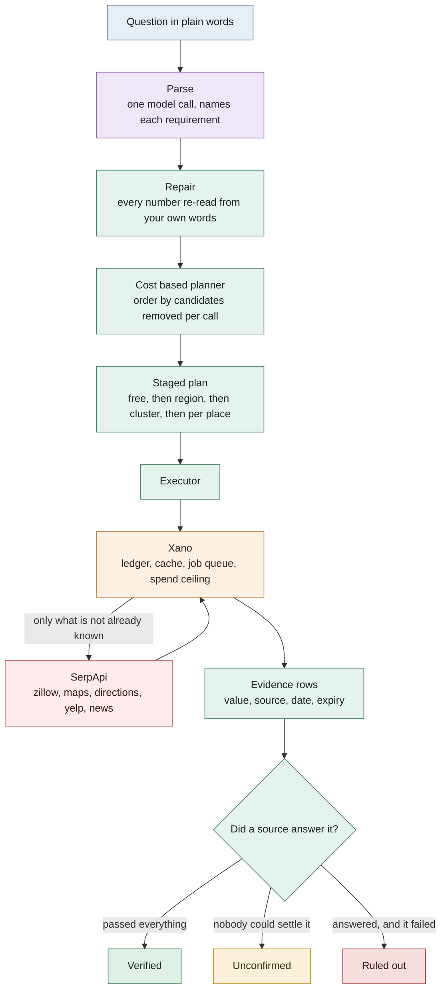

# Relokit

Find places that fit, in a city you do not know yet. Ask in one sentence and
every requirement is checked against the source that actually holds it.

**Live: [relokit-vert.vercel.app](https://relokit-vert.vercel.app)**

> Under $2,800, one bedroom, no more than 25 minutes by bike to 2788 San Tomas
> Expressway, gym within half a mile open before 6am, in-unit laundry, grocery
> open past 10pm.

Six requirements, and no single site can answer them. The rent belongs to a
rental site, the ride to a routing engine, the gym's hours to a maps index. In a
city you already know you fill that gap with instinct. Somewhere new you have
none, and every listing looks equally plausible until you check it yourself.

Relokit does the checking, for twelve kinds of place: rentals, homes for sale,
restaurants, cafes, bars, gyms, groceries, hotels, parks, pharmacies, schools
and universities.

## What comes back

Three lists, never two.

| bucket          | rule                                                     |
| --------------- | -------------------------------------------------------- |
| **Verified**    | every hard requirement passed, and was actually evaluated |
| **Unconfirmed** | something could not be settled                            |
| **Ruled out**   | something was checked and failed                          |

A failed call can never rule a place out. If a source does not answer, the place
moves to unconfirmed with the reason attached, because "could not check" and
"does not qualify" are different answers and merging them is how a tool starts
lying. A price quoted as `$2,495+` settles nothing against a $2,800 cap, so it
goes to unconfirmed with the band shown rather than to a guess.

Every fact carries the source that answered it and how old that answer is.

## How it fits together



There is one purple box, and that is the point. The model reads your sentence and
nothing else. It never sees a listing and it never decides what passes.

## Why not just ask a model with web search

This is the first question people ask, so here is the honest answer.

The model is called once, and only to say which phrase is a budget, which is a
commute, which is an opening time. Its numbers are not trusted either: every
number is re-read from the words you wrote, because the model once read "open
past 10pm" as thirty six thousand seconds, which is ten in the morning, and filed
it as an opening time. The planner, the executor and the verdicts never touch a
model at all.

That split exists for four reasons.

**The work is combinatorial.** Six requirements across the candidates in that box
is 18,179 calls done naively. The planner gets it to 88. An agent looping over
tools has no cost model: it makes a handful of calls and asserts the rest.

**A model cannot tell you what it failed to check.** It writes one confident
paragraph. It has no way to say "for this listing the price is a range, so it
settles nothing against your cap". Relokit can, because it records per place and
per requirement whether a source actually answered. The three buckets are a data
structure, not a prompt.

**Provenance.** Every fact names its source and its age, and you can follow it
back. A generated answer is a blend of whatever was in the context window.

**Reproducibility.** The same question gives the same plan and the same result.

Where a model with search is genuinely better: one fact, asked once. What time
does this gym close. It wins that comfortably. The moment it is many places times
many requirements, and being wrong costs you a year of rent, guessing stops being
acceptable.

## How the ordering works

Sources compete to answer a requirement. The winner removes the most candidates
per call:

```
score = ((1 - selectivity_prior) * coverage) / (cost_units * entities_to_evaluate)
```

Execution runs free predicates first, then region, then cluster, then per place.
Only the last tier scales with the candidate count, so it runs last, against the
smallest set that is still correct.

Five ideas do most of the saving. Two of them are the halves of filter and
refine, which is how spatial databases avoid running an expensive check on
everything: settle cheaply whatever can be settled cheaply, and pay only for
what is left.

- **Free filters first.** A price cap and a bedroom count are filters on the
  search itself. Applying them costs nothing and shrinks everything downstream.
- **A straight line certifies a miss.** It is a hard lower bound on a real
  journey, so if the crow flies further than your limit allows, no road will fit
  and the place is ruled out with no call and no guess. It can never certify a
  hit, because a short line says nothing about the roads.
- **A place already found certifies a hit.** Every nearby search comes back with
  real coordinates, and a shop is where it is whoever asked. Those are pooled, so
  a gym within half a mile of one home can settle the question for a neighbour it
  was never searched for, measured exactly and for no extra call. Finding nothing
  in the pool certifies nothing: it is a union of what searches returned, and
  absence from it is not absence from the map.
- **Clusters before places.** Neighbours share a commute. One call per cluster,
  with slack so a place is only ruled out when even its nearest corner fails.
- **A ledger, not a cache.** Facts are stored per fact with the expiry each one
  deserves. A price is good for two days, opening hours for a month. Asking again
  costs almost nothing.

Scoring is not the whole story either, in two ways.

A source is ranked by how many places it removes per call, which is the right
question while there is a choice between sources and the wrong one when the
alternative is not asking. A source that answers a requirement and rules almost
nothing out scores near zero and loses every round; if the source that outscored
it is then priced out, the requirement comes back unmeasured for every place. So
anything still unanswered at the end takes the cheapest source that can answer it
and still fits, and the interface says that is why it was picked.

And some sources cannot run until another has
bound their inputs. Directions needs a destination point, and producing one
eliminates no candidates, so on pruning power alone a geocode scores zero and
loses every comparison it enters. Selection is a fixpoint over bindings: each
round takes what can run, keeps the best per requirement, and adds what it makes
available.

Priors are learned rather than assumed. Every run records what each source
actually did, and the planner uses measured numbers for a place it has seen
before, falls back to what it measured anywhere, and otherwise says plainly that
the number is an estimate. The interface shows which of the three it used.

## Adding a source is a row, not a deploy

`xano/registry.seed.json` holds one row per capability: which source answers
which requirement, at what granularity, cost, expiry, coverage and precedence.
The planner reads it as data. Pointing the same engine at a different vertical is
a registry change.

## Run it

```
corepack enable
pnpm install
pnpm test
```

No API keys needed. The whole suite replays from committed fixtures and never
reaches the network.

```
pnpm plan       # the plan and cost trace for the demo question
pnpm replay     # the same run end to end, offline
pnpm dev:proxy  # bridge to Xano, keeps the org key out of the browser
pnpm dev:web    # the app on port 5173
```

`pnpm plan` prints `18179 naive | 88 planned`, and `pnpm replay` runs it without
touching the network.

## Layout

| path                   | purpose                                                                |
| ---------------------- | ---------------------------------------------------------------------- |
| `packages/schema`      | Frozen contracts. Everything depends on it, it depends on nothing.     |
| `packages/planner`     | The planner. Pure, synchronous, no I/O.                                |
| `packages/executor`    | Runs a plan, collects evidence, never invents a verdict.               |
| `packages/evidence`    | Provider responses to canonical facts, and facts to buckets.           |
| `packages/serpapi`     | Typed client with fixture record and replay.                           |
| `packages/llm`         | The one model call, and the repair that re-reads every number.         |
| `packages/mcp`         | MCP server. `relokit_plan` runs locally and costs nothing.             |
| `apps/web`             | The app: results, map, provenance, shortlist, watch.                   |
| `apps/proxy`           | The one passage to Xano. Holds the key, never the browser.             |
| `xano/`                | Backend as files: 16 tables, 16 endpoints of our own on top of Xano's auth starter, 4 shared functions, 1 nightly task, 1 AI agent. |
| `tools/record-fixture` | The only thing that can spend a SerpApi search.                        |

Start with [docs/contracts.md](docs/contracts.md) for the wire format,
[docs/cost-model.md](docs/cost-model.md) for the arithmetic,
[docs/architecture.md](docs/architecture.md) for the shape, and
[docs/xano-notes.md](docs/xano-notes.md) for what the backend taught us the hard
way.

## Scripts

| command                  | does                                                            |
| ------------------------ | --------------------------------------------------------------- |
| `pnpm test`              | Full suite, offline.                                            |
| `pnpm typecheck`         | Every package in one pass.                                      |
| `pnpm plan`              | Plan and cost trace for the demo question.                      |
| `pnpm replay`            | The demo run end to end, offline.                               |
| `pnpm ask "<question>"`  | The same flow the browser runs.                                 |
| `pnpm build`             | Builds the web app.                                             |
| `pnpm start`             | The whole product as one process: the built app, /api, the key. |
| `pnpm dev:web`           | Web app on port 5173.                                           |
| `pnpm dev:proxy`         | Serves /api and holds the org key, for development.             |
| `pnpm record <scenario>` | Records a fixture. Spends a real search.                        |

## Fixtures

Recorded responses live in `fixtures/serpapi`, redacted and committed, so the
repository works offline. A fixture miss throws with the command to record it
rather than quietly reaching the network.

## Deploying

One process serves everything: `pnpm build && pnpm start` runs the built app,
`/api` and the org key on any Node host. For Vercel the repo carries
`vercel.json` and `api/proxy.ts`: import the repo, set `XANO_INSTANCE_URL`,
`XANO_API_GROUP` and `RELOKIT_ORG_KEY` in the project environment, deploy. The
app lands on the CDN, the key stays in the function, and HTTPS comes with it,
which is what searching near you requires.

The org key never reaches a browser, and the per run spend ceiling is enforced
inside Xano, so a public URL cannot be used to burn credits.

## MCP

```json
{
  "mcpServers": {
    "relokit": {
      "command": "npx",
      "args": ["tsx", "/absolute/path/to/relokit/packages/mcp/src/index.ts"]
    }
  }
}
```

`relokit_plan` returns a full plan and its cost trace without making a single API
call, so an agent can find out what a question would cost before answering it.
